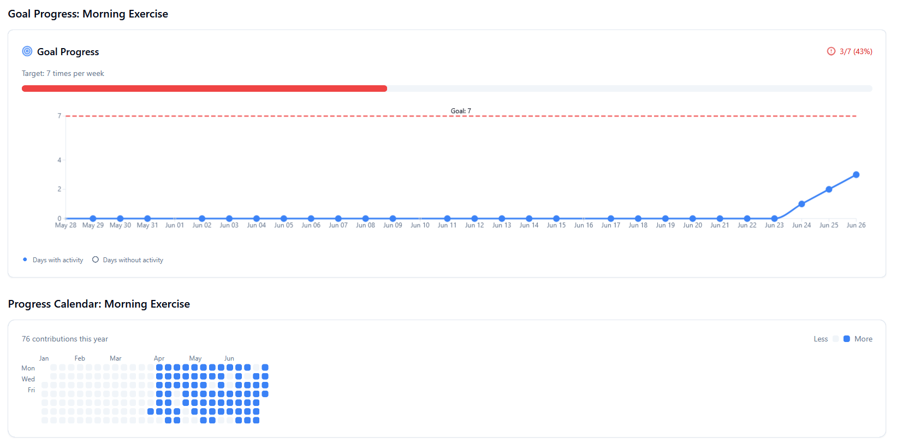

# DayTracker - PWA Habit Tracking Application

[](https://day-spark.muhammadmustafa.dev/)
[](https://www.typescriptlang.org/)
[](https://reactjs.org/)
[](https://supabase.com/)

## 📖 Project Overview

DayTracker is a comprehensive Progressive Web Application (PWA) designed to help users build better habits through daily tracking and visualization. The application provides an intuitive interface for creating custom trackables, monitoring progress through interactive calendars, setting goals, and maintaining streaks - all while working seamlessly offline.

**Main Goals:**

- Provide a reliable, offline-first habit tracking experience
- Offer comprehensive progress visualization and analytics
- Enable goal setting and streak tracking for motivation
- Deliver a native app-like experience across all devices

## 🚀 Live Demo & Screenshots

**Live Demo:** [DayTracker App](https://day-spark.muhammadmustafa.dev/)

### Screenshots

<!-- Add screenshots here -->

- **Dashboard Overview:** 
- **Calendar View:** 
- **Goal Progress:** 
- **Mobile PWA:** 

## 🛠 Tech Stack

### Frontend

- **React 18** with TypeScript - Component-based UI with type safety
- **Vite** - Fast build tool and development server
- **Tailwind CSS** - Utility-first CSS framework
- **Shadcn/UI** - Modern, accessible component library
- **Recharts** - Data visualization library
- **Date-fns** - Date manipulation utilities
- **React Query (TanStack)** - Server state management

### Backend & Database

- **Supabase** - Backend-as-a-Service providing:
  - PostgreSQL database with real-time subscriptions
  - Authentication system
  - Row Level Security (RLS)
  - Edge Functions for serverless compute

### PWA Features

- **Service Worker** - Custom caching strategy for offline functionality
- **Web App Manifest** - Native app-like installation
- **IndexedDB** - Local storage for offline data persistence

### Development & Deployment

- **TypeScript** - Static type checking
- **ESLint** - Code linting and formatting
- **Git** - Version control
- **Vercel/Netlify** - Static site hosting with CI/CD

## 🏗 System Design

### Architecture Overview

```
┌─────────────────┐    ┌─────────────────┐    ┌─────────────────┐
│   React Client  │    │   Service       │    │   Supabase      │
│   (PWA)         │◄──►│   Worker        │◄──►│   Backend       │
│                 │    │   (Offline)     │    │                 │
└─────────────────┘    └─────────────────┘    └─────────────────┘
         │                       │                       │
         ▼                       ▼                       ▼
┌─────────────────┐    ┌─────────────────┐    ┌─────────────────┐
│   IndexedDB     │    │   Cache API     │    │   PostgreSQL    │
│   (Local Data)  │    │   (Static Assets│    │   (Persistent)  │
└─────────────────┘    └─────────────────┘    └─────────────────┘
```

**Architecture Type:** Client-Server with Offline-First PWA

- Single-page application with real-time backend synchronization
- Service worker handles caching and offline scenarios
- Optimistic updates with conflict resolution

### Database Schema Overview

```sql
-- Core Tables
users (id, email, created_at)
trackables (id, user_id, name, description, color, icon)
entries (id, user_id, trackable_id, date, completed, notes)
goals (id, user_id, trackable_id, target_value, target_period)
dashboard_settings (id, user_id, selected_trackables, trackable_order)

-- Relationships
- users → trackables (1:many)
- users → entries (1:many)
- trackables → entries (1:many)
- trackables → goals (1:many)
```

### API Structure

**Supabase Client SDK** - Real-time subscriptions and RESTful operations

```typescript
// Real-time data fetching
const { data, error } = await supabase
  .from("trackables")
  .select("*")
  .eq("user_id", userId);

// Real-time subscriptions
supabase
  .channel("trackables")
  .on(
    "postgres_changes",
    { event: "*", schema: "public", table: "trackables" },
    (payload) => handleRealtimeUpdate(payload)
  )
  .subscribe();
```

### Security & Authentication

- **Row Level Security (RLS)** - Database-level access control
- **JWT Authentication** - Stateless session management
- **Client-side validation** - Input sanitization and type checking

## 🤔 Reasoning for Technical Decisions

### Why React + TypeScript?

**Decision:** React with TypeScript for the frontend
**Reasoning:**

- Strong ecosystem and community support
- Type safety reduces runtime errors and improves developer experience
- Component reusability and maintainability
- Excellent PWA support with modern build tools

**Tradeoffs:** Higher initial setup complexity vs. plain JavaScript, but significantly better long-term maintainability.

### Why Supabase over Custom Backend?

**Decision:** Supabase Backend-as-a-Service
**Reasoning:**

- Rapid development with built-in authentication, real-time subscriptions
- PostgreSQL provides robust relational data modeling
- Row Level Security eliminates need for custom authorization logic
- Built-in Edge Functions for serverless compute when needed

**Tradeoffs:** Vendor lock-in vs. faster time-to-market and reduced infrastructure complexity.

### Why PWA over Native Apps?

**Decision:** Progressive Web App approach
**Reasoning:**

- Single codebase for all platforms reduces development overhead
- Offline-first functionality crucial for habit tracking consistency
- Easy distribution without app stores
- Lower maintenance burden

**Tradeoffs:** Some native API limitations vs. universal compatibility and easier deployment.

### Why Tailwind CSS + Shadcn/UI?

**Decision:** Utility-first CSS with component library
**Reasoning:**

- Rapid prototyping and consistent design system
- Tree-shaking eliminates unused styles
- Shadcn/UI provides accessible, customizable components
- Better maintainability than custom CSS

**Tradeoffs:** Learning curve for utility classes vs. faster development and smaller bundle sizes.

## 🚧 Challenges Faced & Solutions

### 1. Offline Data Synchronization

**Challenge:** Ensuring data consistency when users work offline and come back online.
**Solution:** Implemented optimistic updates with conflict resolution:

```typescript
// Optimistic update pattern
const optimisticUpdate = async (data) => {
  // Update UI immediately
  updateLocalState(data);

  try {
    // Sync with server
    await syncToServer(data);
  } catch (error) {
    // Rollback on failure
    revertLocalState();
    handleSyncError(error);
  }
};
```

### 2. Complex State Management Across Components

**Challenge:** Managing trackable data, entries, and UI state across multiple components.
**Solution:** Implemented React Query for server state and custom hooks for local state:

```typescript
// Custom hook for trackable management
const useTrackables = () => {
  const { data, isLoading, error } = useQuery({
    queryKey: ["trackables"],
    queryFn: fetchTrackables,
    staleTime: 5 * 60 * 1000, // 5 minutes
  });

  return { trackables: data || [], loading: isLoading, error };
};
```

### 3. Performance with Large Datasets

**Challenge:** Calendar rendering became slow with thousands of entries.
**Solution:** Implemented virtualization and data pagination:

```typescript
// Virtualized calendar with date range optimization
const getVisibleDateRange = (viewDate) => {
  const start = startOfMonth(viewDate);
  const end = endOfMonth(viewDate);
  return { start, end };
};

// Only fetch data for visible date range
const { data } = useQuery({
  queryKey: ["entries", dateRange],
  queryFn: () => fetchEntriesInRange(dateRange),
});
```

### 4. PWA Caching Strategy

**Challenge:** Balancing fresh data with offline functionality.
**Solution:** Implemented tiered caching strategy:

```javascript
// Service worker caching strategy
const CACHE_STRATEGIES = {
  static: "cache-first", // App shell, CSS, JS
  api: "network-first", // Dynamic data
  images: "cache-first", // Icons, images
};
```

### 5. Real-time Updates Without Breaking Offline Mode

**Challenge:** Handling real-time subscriptions while maintaining offline functionality.
**Solution:** Conditional subscription management:

```typescript
useEffect(() => {
  if (isOnline && user) {
    const subscription = supabase
      .channel("trackables")
      .on("postgres_changes", handleRealtimeUpdate)
      .subscribe();

    return () => subscription.unsubscribe();
  }
}, [isOnline, user]);
```

## ✨ Core Features

### 1. Trackable Management

**Implementation:** Custom CRUD operations with real-time updates

```typescript
// Location: src/hooks/useTrackables.ts
const createTrackable = async (trackable) => {
  const { data, error } = await supabase
    .from("trackables")
    .insert([{ ...trackable, user_id: user.id }]);

  if (error) throw error;
  return data;
};
```

### 2. Calendar Visualization

**Implementation:** Custom calendar component with contribution-style heatmap

```typescript
// Location: src/components/ContributionCalendar.tsx
const getIntensityColor = (completionCount, maxCompletions) => {
  const intensity = maxCompletions > 0 ? completionCount / maxCompletions : 0;
  return `rgba(34, 197, 94, ${Math.max(0.2, intensity)})`;
};
```

### 3. Goal Setting & Progress Tracking

**Implementation:** Flexible goal system with multiple time periods

```typescript
// Location: src/components/GoalProgressChart.tsx
const calculateProgress = (entries, goal) => {
  const periodEntries = filterEntriesByPeriod(entries, goal.target_period);
  return {
    current: periodEntries.length,
    target: goal.target_value,
    percentage: (periodEntries.length / goal.target_value) * 100,
  };
};
```

### 4. Offline-First Architecture

**Implementation:** Service worker with intelligent caching

```javascript
// Location: public/sw.js
self.addEventListener("fetch", (event) => {
  if (event.request.url.includes("/api/")) {
    event.respondWith(networkFirstStrategy(event.request));
  } else {
    event.respondWith(cacheFirstStrategy(event.request));
  }
});
```

### 5. Dashboard Customization

**Implementation:** Drag-and-drop interface with persistent settings

```typescript
// Location: src/hooks/useDashboardSettings.ts
const updateSettings = async (selectedTrackables, trackableOrder) => {
  const { data } = await supabase.from("dashboard_settings").upsert({
    user_id: user.id,
    selected_trackables: selectedTrackables,
    trackable_order: trackableOrder,
  });

  return data;
};
```

## 🧪 Testing Strategy

### Unit Testing

- **Tool:** Jest + React Testing Library
- **Coverage:** Custom hooks, utility functions, data transformations
- **Example:**

```typescript
describe("useTrackables", () => {
  it("should fetch trackables for authenticated user", async () => {
    const { result } = renderHook(() => useTrackables());
    await waitFor(() => expect(result.current.loading).toBe(false));
    expect(result.current.trackables).toHaveLength(3);
  });
});
```

### Integration Testing

- **Tool:** Playwright
- **Coverage:** End-to-end user flows, PWA functionality
- **Scenarios:** User registration, trackable creation, offline sync

### Performance Testing

- **Tool:** Lighthouse CI
- **Metrics:** Performance score >90, PWA compliance
- **Automated:** Run on every deployment

## 🚀 Deployment

### CI/CD Pipeline

```yaml
# .github/workflows/deploy.yml
name: Deploy
on:
  push:
    branches: [main]
jobs:
  deploy:
    runs-on: ubuntu-latest
    steps:
      - uses: actions/checkout@v3
      - name: Install dependencies
        run: npm ci
      - name: Run tests
        run: npm test
      - name: Build
        run: npm run build
      - name: Deploy to Vercel
        uses: vercel/action@v1
```

### Hosting & Infrastructure

- **Frontend:** Vercel with automatic deployments
- **Backend:** Supabase managed PostgreSQL + Edge Functions
- **CDN:** Vercel Edge Network for global distribution
- **SSL:** Automatic certificate management

### Secrets Management

- **Environment Variables:** Managed through Vercel dashboard
- **API Keys:** Stored securely in Supabase vault
- **Database:** Connection strings in environment variables

## ⚡ Performance Optimization

### Frontend Optimizations

1. **Code Splitting:** Route-based lazy loading

```typescript
const Dashboard = lazy(() => import("./pages/Dashboard"));
const CalendarView = lazy(() => import("./pages/CalendarView"));
```

2. **Memoization:** React.memo and useMemo for expensive computations

```typescript
const MemoizedCalendar = memo(ContributionCalendar);
const sortedTrackables = useMemo(
  () => trackables.sort((a, b) => a.name.localeCompare(b.name)),
  [trackables]
);
```

3. **Image Optimization:** WebP format, lazy loading
4. **Bundle Analysis:** Webpack Bundle Analyzer for size optimization

### Backend Optimizations

1. **Database Indexing:** Composite indexes on frequently queried columns

```sql
CREATE INDEX idx_entries_user_date ON entries(user_id, date);
CREATE INDEX idx_trackables_user ON trackables(user_id);
```

2. **Query Optimization:** Efficient Supabase queries with selective fields
3. **Caching:** Browser caching headers, Service Worker strategies

### PWA Optimizations

1. **Service Worker:** Intelligent caching with cache invalidation
2. **App Shell:** Critical rendering path optimization
3. **Preloading:** Critical resources preloaded on install

## 🔒 Security Considerations

### Authentication & Authorization

- **JWT Tokens:** Secure session management with automatic refresh
- **Row Level Security:** Database-level access control

```sql
CREATE POLICY "Users can only see their own trackables"
ON trackables FOR SELECT
USING (auth.uid() = user_id);
```

### Data Protection

- **Input Validation:** Client and server-side validation
- **XSS Prevention:** Content Security Policy headers
- **CSRF Protection:** SameSite cookies, CSRF tokens

### Privacy

- **Data Minimization:** Only collect necessary user data
- **Encryption:** Data encrypted in transit and at rest
- **Audit Logs:** User action tracking for security monitoring

## 📈 Scalability Considerations

### Database Scaling

- **Read Replicas:** Supabase automatic read scaling
- **Partitioning:** Time-based partitioning for entries table
- **Archiving:** Historical data archival strategy

### Application Scaling

- **Horizontal Scaling:** Stateless frontend enables easy scaling
- **Edge Functions:** Supabase Edge Functions for compute scaling
- **CDN:** Global content distribution

### Performance Monitoring

- **Real User Monitoring:** Sentry for error tracking
- **Performance Metrics:** Core Web Vitals monitoring
- **Database Monitoring:** Supabase built-in analytics

## 💬 Possible Interview Questions & Answers

### "Why did you choose React over Vue or Angular?"

**Answer:** I chose React for its large ecosystem, excellent TypeScript support, and extensive PWA capabilities. The component-based architecture scales well for this type of application, and the rich library ecosystem (React Query, React Hook Form) accelerated development. The learning curve is reasonable, and the job market demand is high.

### "How would you improve this system?"

**Answer:**

1. **Implement real-time collaboration** - Allow family/friend accountability
2. **Add machine learning** - Personalized habit suggestions based on success patterns
3. **Improve offline sync** - Implement operational transformation for conflict resolution
4. **Add advanced analytics** - Correlation analysis between different habits
5. **Implement push notifications** - Reminder system with service worker notifications

### "What was the hardest part of this project?"

**Answer:** The most challenging aspect was implementing reliable offline-first functionality while maintaining data consistency. Specifically, handling the edge cases where users might modify the same data offline on multiple devices. I solved this by implementing a last-write-wins strategy with user-friendly conflict resolution, and careful optimistic update patterns that could gracefully rollback on sync failures.

### "How do you handle real-time updates?"

**Answer:** I use Supabase's real-time subscriptions which leverage WebSockets. The system listens for database changes and automatically updates the UI. For offline scenarios, I queue updates locally and sync when connectivity returns. The challenge was avoiding infinite update loops and managing subscription lifecycle properly.

### "Explain your caching strategy"

**Answer:** I implemented a tiered caching approach:

- **Cache-first** for static assets (app shell, images)
- **Network-first** for dynamic data with fallback to cache
- **Stale-while-revalidate** for user-generated content
  This ensures fast loading while keeping data fresh, crucial for a habit tracking app where users need current information.

### "How would you handle 100,000 users?"

**Answer:**

1. **Database optimization** - Implement read replicas, add database indices, partition large tables
2. **Frontend scaling** - Use CDN, implement proper code splitting, optimize bundle size
3. **Caching layer** - Add Redis for session management and frequently accessed data
4. **Monitoring** - Implement comprehensive logging and alerting
5. **Rate limiting** - Protect against abuse and ensure fair usage

## 🏃‍♂️ How to Run Locally

### Prerequisites

- Node.js 18+ and npm
- Supabase account and project
- Git

### Setup Instructions

1. **Clone the repository**

```bash
git clone https://github.com/yourusername/daytracker.git
cd daytracker
```

2. **Install dependencies**

```bash
npm install
```

3. **Environment setup**

```bash
cp .env.example .env.local
# Add your Supabase project URL and anon key
```

4. **Database setup**

```bash
# Run the SQL migrations in Supabase dashboard
# Import the schema from /supabase/migrations/
```

5. **Start development server**

```bash
npm run dev
```

6. **Build for production**

```bash
npm run build
npm run preview
```

### Environment Variables

```env
VITE_SUPABASE_URL=your_supabase_project_url
VITE_SUPABASE_ANON_KEY=your_supabase_anon_key
```

## 🔮 Future Improvements

### Short-term (1-3 months)

- [ ] **Social features** - Share progress with friends/family
- [ ] **Advanced analytics** - Habit correlation analysis
- [ ] **Export functionality** - Data export to CSV/PDF
- [ ] **Habit templates** - Pre-configured popular habits

### Medium-term (3-6 months)

- [ ] **Mobile app** - React Native version for better native integration
- [ ] **AI insights** - Personalized recommendations based on patterns
- [ ] **Integration APIs** - Connect with fitness trackers, calendars
- [ ] **Advanced goal types** - Numerical goals, frequency-based goals

### Long-term (6+ months)

- [ ] **Multi-tenant architecture** - Team/organization accounts
- [ ] **Machine learning** - Predictive analytics for habit success
- [ ] **Gamification** - Achievement system, leaderboards
- [ ] **Voice interface** - Voice commands for quick check-ins

---

## 📄 License

MIT License - see [LICENSE](LICENSE) file for details.

## 🤝 Contributing

1. Fork the repository
2. Create a feature branch (`git checkout -b feature/amazing-feature`)
3. Commit your changes (`git commit -m 'Add amazing feature'`)
4. Push to the branch (`git push origin feature/amazing-feature`)
5. Open a Pull Request

---

**Built with ❤️ for better habits and personal growth**
